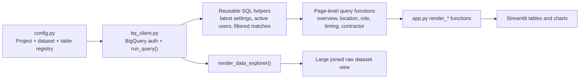
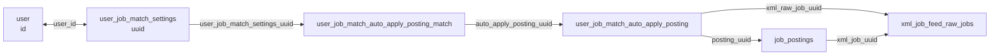

# BigQuery Data Layer Recreation Guide

This guide documents how the Job Match Analysis project:

- connects to BigQuery
- defines the warehouse tables
- maps table relationships
- scopes users for dashboard analysis
- builds reusable SQL helpers
- renders large joined datasets into the dashboard

Use this if you want to recreate the same data layer in another project.

## 1. Files That Matter

### Core data-layer files

- `config.py`
  - defines the BigQuery project, dataset, table registry, join metadata, nested-field flattening rules, and credentials path
- `bq_client.py`
  - owns BigQuery authentication, query execution, schema inspection, reusable CTE helpers, and all dashboard SQL
- `app.py`
  - calls the query functions in `bq_client.py`, turns the result DataFrames into dashboard tables/charts, and displays the large joined datasets
- `queries.py`
  - small generic SQL-template file; useful for simple patterns, but not the main dashboard query layer

### Schema/reference files

- `reference/claude.md`
  - narrative schema reference for the six core tables and their business meaning
- `reference/field_reference.csv`
  - exported column-level master reference across the six core tables

### Utility scripts

- `explore_all_schemas.py`
  - queries `INFORMATION_SCHEMA` and samples values across all six tables
- `explore_nested_fields.py`
  - inspects nested `target_*` fields in `user_job_match_settings`
- `export_references.py`
  - exports schema reference CSVs into the `reference/` folder

## 2. End-to-End Data Flow



## 3. Where BigQuery Connection Happens

### Warehouse config

`config.py` is the root of the warehouse setup:

- `PROJECT_ID` and `DATASET` define the BigQuery location
- `TABLES` maps logical table names to fully qualified BigQuery tables
- `CREDENTIALS_PATH` points to `credentials/service-account.json` by default

Relevant source:

- `config.py:6-35`
- `config.py:92-112`

### Authentication and query execution

`bq_client.py` owns the actual connection:

- `get_client()`
  - uses a local service account JSON file if present
  - otherwise falls back to `st.secrets["gcp_service_account"]`
- `run_query(sql, params=None)`
  - executes the SQL and returns a pandas DataFrame

Relevant source:

- `bq_client.py:187-223`

### Live schema inspection

`get_table_schema()` queries `INFORMATION_SCHEMA.COLUMNS`:

- lets the app inspect the live schema at runtime
- powers the Data Explorer schema panels

Relevant source:

- `bq_client.py:226-238`
- `queries.py:5-10`
- `app.py:3551-3640`

## 4. How Table Names And Connections Are Defined

### Table registry

The six core tables are registered in `config.TABLES`:

- `user_job_match_settings`
- `user`
- `user_job_match_auto_apply_posting_match`
- `user_job_match_auto_apply_posting`
- `job_postings`
- `xml_job_feed_raw_jobs`

Relevant source:

- `config.py:10-35`

### Join metadata

`config.JOINS` contains a small join map:

- `user_job_match_settings.user_id -> user.id`
- `user_job_match_settings.uuid -> user_job_match_auto_apply_posting_match.user_job_match_settings_uuid`

Important note:

`config.JOINS` is not the full analytical join graph. The real dashboard join logic lives in `bq_client.py` helper CTEs and page-level queries.

Relevant source:

- `config.py:41-45`

## 5. Actual Analytical Join Graph

The dashboard effectively uses this relationship graph:



### What each join is used for

- `user_job_match_settings -> user`
  - account creation date, resume presence, user identity
- `user_job_match_settings -> user_job_match_auto_apply_posting_match`
  - match outcomes for a given user settings record
- `posting_match -> auto_apply_posting`
  - wrapper record that resolves the surfaced job
- `auto_apply_posting -> job_postings`
  - canonical Bandana posting
- `auto_apply_posting/job_postings -> xml_job_feed_raw_jobs`
  - XML feed resolution for XML-only analysis

Relevant source:

- `bq_client.py:57-76`
- `bq_client.py:120-177`
- `reference/claude.md:301-343`
- `reference/claude.md:346-434`

## 6. Active Match User Scope

The dashboard does not use all users. It uses an "active match user" scope.

Current definition:

- the latest `user_job_match_settings` row per `user_id`
- `user.default_resume_id IS NOT NULL`
- `user_job_match_settings.status != 'PAUSED'`

This logic is centralized in these helpers:

- `_active_settings_predicate()`
- `_resume_ready_predicate()`
- `_active_match_user_predicate()`
- `_latest_settings_snapshot_query()`
- `_latest_active_settings_cte()`
- `_active_match_user_ids_subquery()`

Relevant source:

- `bq_client.py:42-107`

### Why this matters

This scope is reused almost everywhere:

- overview KPIs
- target location demand
- target role demand
- location x role coverage
- role x geography coverage
- intake-by-signup-date tables
- XML/native filtering

If you recreate the project elsewhere, port this logic first.

## 7. Reusable SQL Patterns In `bq_client.py`

### Latest settings snapshot

Purpose:

- dedupe to one settings row per user
- carry current settings state into all demand-side analysis

Key implementation:

- `ROW_NUMBER() OVER (PARTITION BY user_id ORDER BY COALESCE(updated_at, created_at) DESC, created_at DESC, uuid DESC) = 1`

Relevant source:

- `bq_client.py:57-85`

### Latest active settings CTE

Purpose:

- limit the latest settings snapshot to current active match users

Relevant source:

- `bq_client.py:88-96`

### Filtered matches CTE

Purpose:

- filter match records by:
  - current active-match-user scope
  - optional match `created_at` window
  - optional XML/native source filter

Relevant source:

- `bq_client.py:120-146`

### Filtered XML matches CTE

Purpose:

- resolve a match down to an XML job UUID
- support XML-only analysis and XML drilldowns

Relevant source:

- `bq_client.py:149-177`

### Generic raw joined dataset helper

Purpose:

- build a large joined DataFrame across:
  - `user_job_match_settings` as `s`
  - `user` as `u`
  - `user_job_match_auto_apply_posting_match` as `p`
- flatten nested fields like `target_locations` and `target_roles_ref`
- power raw validation and ad hoc exploration

Relevant source:

- `bq_client.py:273-323`

This is the simplest function to port if you want a reusable raw-data browser in another project.

## 8. Where The Dashboard Displays Large Datasets

### Main raw explorer

`render_data_explorer()` is the clearest example of large joined dataset display:

- loads live schemas with `get_table_schema()`
- lets the user pick settings/user/posting columns
- lets the user add time and custom filters
- calls `query_three_way_join()`
- displays the result with `st.dataframe()`

Relevant source:

- `app.py:3551-3640`

### Analytical pages

Each dashboard page follows the same pattern:

1. build page-local filters in `app.py`
2. call cached query functions that wrap `bq_client`
3. receive pandas DataFrames
4. add derived columns client-side
5. render tables/charts with `st.dataframe()` and `st.plotly_chart()`

Examples:

- overview: `app.py:1516-2024`
- match funnel: `app.py:2035-2161`
- user cohorts: `app.py:2172-2246`
- location analysis: `app.py:2256-2839`
- role & industry: `app.py:2846-3340`
- match timing: `app.py:3347-3442`
- contractor performance: `app.py:3453-3537`

## 9. Table-by-Table Inventory

This section combines:

- the business descriptions in `reference/claude.md`
- the exact column lists in `reference/field_reference.csv`

### 9.1 `user`

Purpose:

- one row per Bandana user account
- includes active, paused, draft, and unenrolled accounts
- used for account-level metadata such as `created_at` and `default_resume_id`

Primary key:

- `id`

Key joins:

- `user.id <- user_job_match_settings.user_id`

Key fields for this dashboard:

- `created_at`
- `default_resume_id`
- `first_name`
- `last_name`
- `name`
- `last_login`
- `dma_uuid`
- `internal`

Full column list (27):

```text
id, name, email_verified, image, phone_verified, referred_by, referrer_id, neighborhood_uuid, place_id, current_pay, target_benefits, target_pay, created_at, updated_at, subscription_default, super_admin, merged_into_user_id, first_name, last_name, internal, default_resume_id, state, image_file_uuid, enrolled_in_recommendations, last_login, dma_uuid, last_sendgrid_contact_synced_at
```

Reference:

- `reference/claude.md:183-216`

### 9.2 `user_job_match_settings`

Purpose:

- one row per Job Match user
- stores current match preferences and operational state
- main demand-side table for target roles, target locations, and user settings

Primary key:

- `uuid`

Key joins:

- `user_job_match_settings.user_id -> user.id`
- `user_job_match_settings.uuid -> user_job_match_auto_apply_posting_match.user_job_match_settings_uuid`

Key fields for this dashboard:

- `status`
- `strategy`
- `created_at`
- `updated_at`
- `minimum_pay`
- `experience_level`
- `open_to_any_city`
- `open_to_remote`
- `open_to_hybrid`
- `target_locations`
- `target_roles_ref`
- `target_industries`
- `target_certifications`
- `assigned_user_id`
- `contractor_status`
- `last_job_match_activity_at`

Nested fields that matter most:

- `target_locations`
- `target_roles_ref`
- `target_industries`
- `target_certifications`
- `target_role_class`
- `target_education_fields`

Full column list (46):

```text
uuid, user_id, created_at, updated_at, status, over_eighteen, resume_link, minimum_pay, target_roles, target_boroughs, target_job_type, target_benefits, user_subscription_uuid, assigned_user_id, internal_notes, is_disabled, is_veteran, needs_sponsorship, open_to_any_city, open_to_hybrid, open_to_remote, race, able_to_drive, education_field, education_gpa, education_level, gender, sms_enabled, strategy, raw_notion_locations, contractor_status, experience_level, last_job_match_activity_at, sendblue_activity_status, follow_up_sent_at, sendblue_follow_up_started_at, follow_up_template, enrolled_in_sendblue, target_locations, target_industries, target_transit_lines, target_neighborhoods, target_certifications, target_roles_ref, target_role_class, target_education_fields
```

Reference:

- `reference/claude.md:219-298`

### 9.3 `user_job_match_auto_apply_posting`

Purpose:

- wrapper table for jobs that become eligible for auto-apply
- bridges match rows to both canonical Bandana postings and XML jobs

Primary key:

- `uuid`

Key joins:

- `user_job_match_auto_apply_posting.uuid <- user_job_match_auto_apply_posting_match.auto_apply_posting_uuid`
- `user_job_match_auto_apply_posting.posting_uuid -> job_postings.uuid`
- `user_job_match_auto_apply_posting.xml_raw_job_uuid -> xml_job_feed_raw_jobs.uuid`

Key fields for this dashboard:

- `posting_uuid`
- `xml_raw_job_uuid`
- `canonical_app_link`
- `contractor_instructions`
- `needs_verification_code`

Full column list (9):

```text
uuid, created_at, updated_at, posting_uuid, xml_raw_job_uuid, canonical_app_link, tags, contractor_instructions, needs_verification_code
```

Reference:

- `reference/claude.md:301-316`

### 9.4 `user_job_match_auto_apply_posting_match`

Purpose:

- core match table
- one row per user matched to one job
- tracks the lifecycle from generation to approval to application outcome

Primary key:

- `uuid`

Key joins:

- `user_job_match_auto_apply_posting_match.user_job_match_settings_uuid -> user_job_match_settings.uuid`
- `user_job_match_auto_apply_posting_match.auto_apply_posting_uuid -> user_job_match_auto_apply_posting.uuid`

Key fields for this dashboard:

- `created_at`
- `status`
- `cpa`
- `applied_at`
- `user_approved_at`
- `user_rejected_at`
- `creator_id`
- `match_generation_version`
- `assignedUserId`

Full column list (18):

```text
uuid, created_at, updated_at, auto_apply_posting_uuid, user_job_match_settings_uuid, status, assignedUserId, cpa, contractornotes, ipAddressUuid, applied_at, job_posting_application_uuid, creator_id, user_approved_at, user_rejected_at, hidden, hide_match_at, match_generation_version
```

Reference:

- `reference/claude.md:319-343`

### 9.5 `job_postings`

Purpose:

- canonical Bandana job listing table
- one row per job opportunity
- used when the dashboard needs posting metadata, job characteristics, or XML linkage from the promoted posting side

Primary key:

- `uuid`

Key joins:

- `job_postings.uuid <- user_job_match_auto_apply_posting.posting_uuid`
- `job_postings.xml_job_uuid -> xml_job_feed_raw_jobs.uuid`

Key fields for this dashboard:

- `role_name`
- `role_uuid`
- `standard_role_uuid`
- `location_uuid`
- `company_uuid`
- `job_source_uuid`
- `app_link`
- `direct_apply`
- `easy_apply`
- `expired`
- `remote`
- `pay_*` normalized compensation columns
- `xml_job_uuid`

Full column list (86):

```text
uuid, created_at, updated_at, key, added_date, expiration_date, slug, webflow_slug, webflow_id, app_link, top_priority, expired, featured, weekly_hours, pay_quantity, pay_unit, last_checked_at, benefits_uuid, role_uuid, company_uuid, job_source_uuid, location_uuid, primary_photo, indexable, last_expiry_checked_at, last_job_indexed_at, last_search_indexed_at, prioritize_indexing, tip_percent, email_template, subject_template, last_updated_at_external, direct_apply, needs_review, created_by_user_id, sponsored, draft, summarization, tip_quantity, urgently_hiring, business_team_uuid, max_pay_quantity, app_email, app_method, job_original_id, calendar_event, last_open_search_indexed_at, removed_from_open_search_index_at, education_level, experience_level, description, hash_matches, min_exp_years, original_role_uuid, qualifications, role_name, pay_per_day, pay_per_hour, pay_per_month, pay_per_week, pay_per_year, frozen_modifications, original_values, last_elasticsearch_indexed_at, commission_quantity, searchable, terminate_sponsorship_at, standard_role_uuid, blacklisted, remote, needs_elasticsearch_indexing, training, pay_per_hour_above_min_wage, easy_apply, expire_posting_at, benji_box_meta_data_uuid, role_class_type_uuid, pay_needs_recalculation, needs_search_validation, search_validation_reason, education_field, last_semantic_indexed_at, needs_semantic_indexing, education_field_uuid, xml_job_uuid, unlisted
```

Reference:

- `reference/claude.md:63-180`

### 9.6 `xml_job_feed_raw_jobs`

Purpose:

- raw inbound XML feed jobs
- pre-cleaning / pre-promotion representation of external jobs
- used heavily for XML-only coverage, monetization, and supply analysis

Primary key:

- `uuid`

Key joins:

- `xml_job_feed_raw_jobs.uuid <- user_job_match_auto_apply_posting.xml_raw_job_uuid`
- `xml_job_feed_raw_jobs.uuid <- job_postings.xml_job_uuid`

Key fields for this dashboard:

- `role_name`
- `company_name`
- `city`
- `state`
- `country`
- `category`
- `segment_name`
- `cpc`
- `cpa`
- `posted_date`
- `expiration_date`
- `mobile_friendly`
- `needs_verification_step`
- `job_posting_uuid`

Full column list (57):

```text
uuid, created_at, updated_at, xml_job_feed_uuid, job_id, role_name, company_name, app_link, last_run_id, cpc, cpa, location, streetaddress, city, state, country, zipcode, latitude, longitude, posted_date, expiration_date, description, pay, pay_max, pay_min, pay_unit, pay_type, experience, education, job_type, organization_id, company_id, category, category_id, logo, mobile_friendly, html_jobs, segment_name, tenant_id, requirement, feed_expired, extra_data, expired, status, upsert_status, branded_link_uuid, should_prioritize, xml_source_url, needs_verification_step, airtable_base_id, airtable_record_id, airtable_table_id, job_posting_uuid, monitor_for_notification, additional_clicks_max, additional_clicks_min, additional_clicks_mode
```

Reference:

- `reference/claude.md:346-434`

## 10. How To Recreate This In Another Project

### Step 1: Copy the warehouse config pattern

Create a config module that defines:

- `PROJECT_ID`
- `DATASET`
- `TABLES`
- `CREDENTIALS_PATH`

Minimal pattern:

```python
PROJECT_ID = "your-gcp-project"
DATASET = "your_dataset"

TABLES = {
    "user": {"full": f"{PROJECT_ID}.{DATASET}.user"},
    "user_job_match_settings": {"full": f"{PROJECT_ID}.{DATASET}.user_job_match_settings"},
    "user_job_match_auto_apply_posting_match": {"full": f"{PROJECT_ID}.{DATASET}.user_job_match_auto_apply_posting_match"},
    "user_job_match_auto_apply_posting": {"full": f"{PROJECT_ID}.{DATASET}.user_job_match_auto_apply_posting"},
    "job_postings": {"full": f"{PROJECT_ID}.{DATASET}.job_postings"},
    "xml_job_feed_raw_jobs": {"full": f"{PROJECT_ID}.{DATASET}.xml_job_feed_raw_jobs"},
}
```

### Step 2: Copy the BigQuery client pattern

You need:

- `get_client()`
- `run_query()`
- `get_table_schema()`
- `get_full_table()`

These are the minimum primitives.

### Step 3: Port the reusable CTE layer

Copy or recreate:

- latest settings snapshot per user
- active match-user filter
- filtered match CTE
- XML match CTE

This is the heart of the analytical model.

### Step 4: Recreate the raw validation join

Port `query_three_way_join()` first.

Why:

- it is the easiest way to sanity-check joins
- it helps you validate row counts and filters before building dashboard metrics
- it is the fastest way to inspect the large joined dataset

### Step 5: Build page-specific query functions

After the helpers are stable, build functions like:

- overview KPIs
- target location performance
- target role performance
- location x role funnels
- XML-only drilldowns

Keep each function:

- SQL-only
- stateless
- DataFrame-returning

### Step 6: Add a schema browser

Recreate a small data explorer like:

- `get_table_schema(table_name)`
- joined result browser with selected columns
- custom where clause
- row limit + order by

This saves time when a dashboard metric looks wrong.

### Step 7: Export documentation artifacts

Keep a local reference folder with:

- narrative schema doc like `claude.md`
- machine-friendly schema export like `field_reference.csv`
- optional nested-field exploration scripts

## 11. Practical Tips

- The real analytical join logic is in `bq_client.py`, not `config.JOINS`.
- `user_job_match_settings` contains nested arrays. You must explicitly `UNNEST()` fields like `target_locations` and `target_roles_ref`.
- Current user-demand views should generally use the latest settings snapshot per `user_id`, not raw historical settings rows.
- Match outcome views should generally use `user_job_match_auto_apply_posting_match.created_at`.
- Signup/intake views should generally use `user.created_at`.
- For XML analysis, do not rely only on `xml_raw_job_uuid`; promoted XML jobs can also be resolved via `job_postings.xml_job_uuid`.

## 12. Best Starting Points In This Repo

If you only open a few files, start here:

- `config.py`
- `bq_client.py`
- `app.py`
- `reference/claude.md`
- `reference/field_reference.csv`

If you only copy a few functions into another codebase, start here:

- `bq_client.get_client()`
- `bq_client.run_query()`
- `bq_client.get_table_schema()`
- `bq_client.query_three_way_join()`
- the helper CTEs at the top of `bq_client.py`

